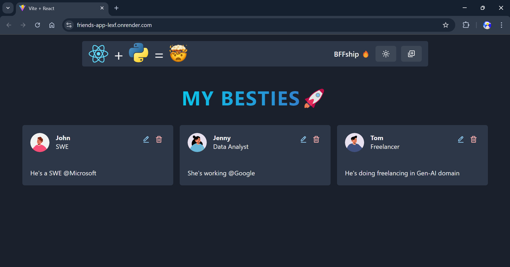

<div align="center">
  <div>
    
    
    
  </div>

  <h3 align="center">Friends App</h3>

</div>

## 📋 <a name="table">Table of Contents</a>

1. 🤖 [Introduction](#introduction)
2. ⚙️ [Tech Stack](#tech-stack)
3. 🔋 [Features](#features)
4. 🤸 [Quick Start](#quick-start)
5. 🖼️ [Screenshots](#screenshots)
6. 🔗 [Links](#links)

## <a name="introduction">🤖 Introduction</a>

Friends App is a simple web application that allows users to manage their friends list. You can add, update, view, and delete friends, along with their descriptions and titles. Profile pictures are dynamically generated based on the gender of each friend using the Avatar Placeholder API. The app offers a clean and responsive UI built with Chakra UI.

## <a name="tech-stack">⚙️ Tech Stack</a>

- **Python** (Flask)
- **React** (with Vite)
- **SQLite** (Database)
- **Chakra UI**

## <a name="features">🔋 Features</a>

👉 **Add Friends**: Add a new friend with a description and title.

👉 **View Friends**: View a list of all friends along with their details.

👉 **Update Friends**: Modify details of an existing friend.

👉 **Delete Friends**: Remove a friend from your list.

👉 **Dynamic Profile Pictures**: Profile pictures are generated based on gender using the Avatar Placeholder API.

👉 **Responsive Design**: Seamlessly adapts to devices of all screen sizes using Chakra UI.

## <a name="quick-start">🤸 Quick Start</a>

Follow these steps to set up the project locally on your machine.

### **Prerequisites**

Ensure you have the following installed:

- [Git](https://git-scm.com/)
- [Node.js and npm](https://nodejs.org/)
- [Python](https://www.python.org/)
- SQLite (Pre-installed with Python)

### **Cloning the Repository**

```bash
git clone https://github.com/yourusername/Friends-App.git
cd Friends-App
```
### **Backend Setup (Flask with SQLite)**

1. Navigate to the `backend` directory:

    ```bash
    cd backend
    ```

2. Install Python dependencies:

    ```bash
    pip install -r requirements.txt
    ```

3. Ensure that the `friends.db` SQLite database is in the `instance` folder.

4. Start the Flask server:

    ```bash
    flask run
    ```

The Flask app will automatically use the `friends.db` database located in the `instance` folder.


### **Frontend Setup (React with Vite)**

1. Navigate to the `frontend` directory:

    ```bash
    cd ../frontend
    ```

2. Install npm dependencies:

    ```bash
    npm install
    ```

3. Start the Vite development server:

    ```bash
    npm run dev
    ```

### **Access the App**

Open [http://localhost:5000](http://localhost:5000) in your browser to view the project.

## 🖼️ **Screenshot**



